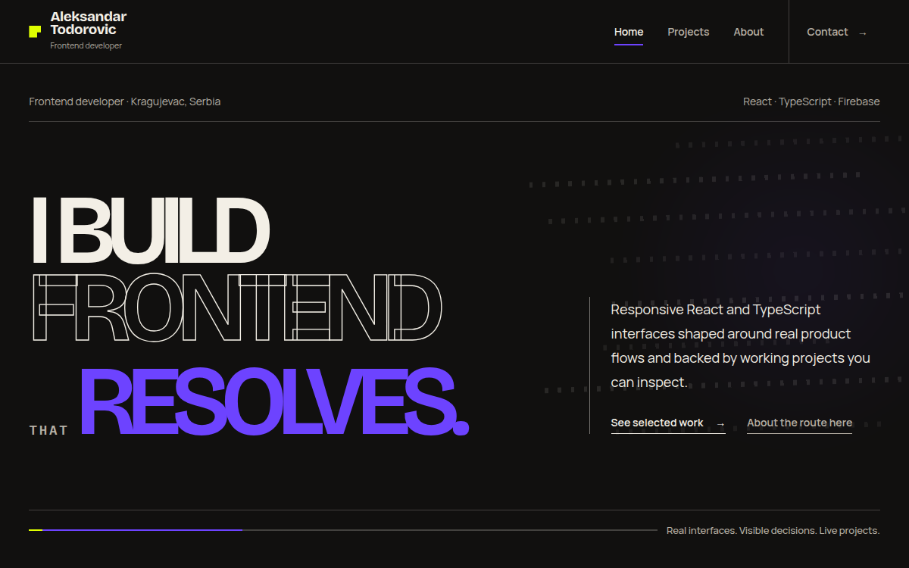

# Developer Portfolio — Aleksandar Todorovic

A React + TypeScript portfolio built around inspectable project evidence rather than a generic project gallery.

The site presents three focused case studies that show different parts of my frontend work:

- **LifeRecompiled** — React/Firebase engineering depth
- **Training App** — product thinking and local-first continuity
- **TaskFlow** — practical React + TypeScript UI



> **Status:** V1 implementation, public copy and automated QA are complete. Final production deployment verification is the remaining release step.

**Repository:** [github.com/aleksandar-todorovic-dev/developer-portfolio](https://github.com/aleksandar-todorovic-dev/developer-portfolio)<br>
**Live portfolio:** [developer-portfolio-two-rho.vercel.app](https://developer-portfolio-two-rho.vercel.app)<br>
**LinkedIn:** [linkedin.com/in/aleksandar-todorovic-dev](https://www.linkedin.com/in/aleksandar-todorovic-dev)<br>
**CV:** [Aleksandar_Todorovic_CV.pdf](./public/Aleksandar_Todorovic_CV.pdf)

---

## Why this portfolio exists

The goal of this project is not to list every exercise or repository I have built.

It is a focused frontend portfolio that makes the work inspectable: real interfaces, implementation decisions, limitations, responsive behavior, accessibility details and the reasoning behind three selected projects.

The visual direction is intentionally strongest on the Home route, while Projects, case studies, About and Contact become calmer where reading and inspection matter more.

---

## What it demonstrates

This portfolio is also a frontend project in its own right. It demonstrates:

- React + TypeScript application structure
- route-based composition with React Router
- typed shared project content
- responsive layouts from small mobile widths through desktop
- centralized route focus, scroll and hash behavior
- keyboard-safe navigation and evidence interactions
- finite motion with complete reduced-motion states
- real project screenshots with selector/lightbox behavior
- runtime route metadata plus build-time static metadata documents
- automated browser and accessibility regression checks
- Vercel-oriented clean URLs, custom 404 handling, robots and sitemap support

The application remains **client-rendered React**. The build-time route documents exist to expose route metadata before JavaScript runs; this is not an SSR migration.

---

## Selected work

| Project | Portfolio role | What it shows | Live |
| --- | --- | --- | --- |
| **LifeRecompiled** | Engineering depth | React + Firebase architecture, authentication, Firestore, Cloud Functions, resilient saved-content behavior, reactions and staged deletion flows | [liferecompiled.com](https://liferecompiled.com) |
| **Training App** | Product thinking | Mobile-first guided workout execution, reducer-driven state, local persistence, partial-day behavior and cycle continuity | [training-app-mvp.web.app](https://training-app-mvp.web.app) |
| **TaskFlow** | TypeScript UI | Typed React contracts, Context, immutable nested-state updates, drag-and-drop and generic local persistence | [taskflow-kanban-kappa.vercel.app](https://taskflow-kanban-kappa.vercel.app) |

### LifeRecompiled

LifeRecompiled is the strongest engineering case study in the portfolio.

Its case study focuses on where backend authority matters most, including higher-risk operations, reaction correctness, saved-content resilience and a staged deletion lifecycle. It also keeps remaining MVP hardening needs visible instead of presenting the project as a finished commercial platform.

### Training App

Training App is a mobile-first workout product built around guided execution and a training cycle that keeps its order when the calendar changes.

The project emphasizes product structure, progressive disclosure, reducer-managed runtime state, versioned local persistence and honest handling of partial sessions. V1 deliberately stays local-first, so progress belongs to one browser rather than a cloud account.

### TaskFlow

TaskFlow is a focused React + TypeScript Kanban board.

It began from a guided course foundation and was completed and independently refined into a portfolio project. Its main technical proof is practical TypeScript inside real React interaction: typed component contracts, Context, reusable update helpers, drag-and-drop state changes and a generic `useLocalStorage<T>` pattern.

---

## Tech stack

### Application

- React
- TypeScript
- Vite
- React Router
- Tailwind CSS
- Motion for React

### Quality and browser testing

- ESLint
- TypeScript project build
- Playwright
- axe accessibility checks

### Delivery

- npm
- Git / GitHub
- Vercel
- build-time metadata generation

---

## Route structure

```text
/
├── /projects
│   ├── /projects/liferecompiled
│   ├── /projects/training-app
│   └── /projects/taskflow
├── /about
└── /contact
```

Unknown page and project routes render dedicated Not Found states.

### Route roles

- **Home** — the most authored route; introduces the work through project-specific evidence scenes.
- **Projects** — a fast comparison route across the three proof roles.
- **Project details** — calmer case studies with screenshots, decisions, validation, limitations and project-specific technical evidence.
- **About** — connects earlier IT support and operational responsibility with current frontend work.
- **Contact** — direct email-first contact with professional links.

---

## Architecture

The portfolio uses a shared application shell without forcing every route or project into the same visual component template.

### Typed project content

Repeated project facts and canonical short descriptions live in typed shared project data.

That shared model handles information such as:

- project identity
- portfolio proof role
- technology summary
- role and scope
- key decision
- central constraint
- current status
- screenshots
- case-study content
- validation and limitations
- live/source links
- next-project navigation

Project-specific visual scenes stay local where a shared abstraction would flatten the composition.

### Centralized route behavior

Scroll, focus and hash navigation have one owner.

The intended behavior is:

```text
initial load without hash
→ update metadata
→ preserve normal browser focus

initial load with valid hash
→ scroll to and focus the target

later PUSH / REPLACE without valid hash
→ scroll to top
→ focus the semantic page heading

later PUSH / REPLACE with valid hash
→ scroll to and focus the target

POP
→ preserve native browser restoration
```

Each public route exposes a semantic focus target through `h1#page-heading`.

---

## Accessibility and navigation

Accessibility work is treated as application behavior rather than a final visual checklist.

Implemented behavior includes:

- skip link to the main content
- visible keyboard focus
- semantic page-heading focus targets
- accessible mobile-menu focus trap
- Escape-to-close and focus restoration
- body scroll locking with desktop-resize cleanup
- screenshot selectors with manual activation
- orientation-aware arrow-key behavior
- Home/End support in evidence selectors
- keyboard-accessible lightbox behavior
- Escape and focus restoration from the lightbox
- fallback behavior when an image popup is blocked
- direct `mailto:` behavior
- clipboard success/fallback feedback on Contact
- CV download semantics
- complete reduced-motion states

Automated axe checks reported no violations in the tested WCAG A/AA rule set across the checked routes and interactions. This is regression evidence, not a claim of complete accessibility certification across every browser and assistive technology.

---

## Motion

Motion is selective and finite.

The rules for V1 are:

- content remains understandable from the first frame
- each sequence ends in a stable state
- Hero motion may be visible and memorable
- Hero motion replays on refresh, not on internal return
- project motion illustrates a real state or relationship
- no essential information depends on animation
- no looping identity animation
- reduced motion renders the complete usable state immediately

The goal is to give the interface temporal character without turning the portfolio into a showreel.

---

## Responsive approach

The final responsive contract was checked across these core widths:

```text
320 / 375 / 390 / 430 / 768 / 1024 / 1440
```

Additional regression widths included:

```text
639 / 640 / 767 / 769 / 1023 / 1280 / 1536
```

The layout is expected to preserve:

- no horizontal overflow
- readable long project names
- inspectable screenshots
- natural wrapping for long email/text content
- keyboard and focus usability
- complete reduced-motion states
- usable 200% desktop reflow

A specific Hero rule keeps the composition stable around tablet widths:

```text
below 1024 px
→ Hero height follows content

1024 px and above
→ large viewport composition may apply
```

---

## Route metadata and discoverability

Route metadata is centralized.

The project includes:

- route-specific titles and descriptions
- runtime metadata updates during internal navigation
- build-time static HTML route documents with metadata available before JavaScript executes
- canonical URL support when a production origin is configured
- social preview metadata
- favicon
- robots support
- sitemap generation
- `noindex` behavior for Not Found states
- Vercel clean-URL and custom-404 support

Production-origin-dependent values use `VITE_SITE_URL` or the production Vercel origin and must be verified after deployment.

Again, this metadata approach does **not** turn the React application into SSR.

---

## Project structure

Abbreviated structure:

```text
developer-portfolio/
├── public/
│   ├── images/
│   ├── Aleksandar_Todorovic_CV.pdf
│   ├── favicon.svg
│   ├── robots.txt
│   └── social-preview.png
├── scripts/
│   └── prerender-metadata.mjs
├── src/
│   ├── components/
│   │   ├── home/
│   │   ├── layout/
│   │   ├── projects/
│   │   └── ui/
│   ├── data/
│   ├── pages/
│   ├── routes/
│   └── ...
├── tests/
│   └── portfolio.spec.ts
├── playwright.config.ts
├── vercel.json
└── package.json
```

---

## Local development

### 1. Clone the repository

```bash
git clone https://github.com/aleksandar-todorovic-dev/developer-portfolio.git
cd developer-portfolio
```

### 2. Install dependencies

```bash
npm install
```

### 3. Start the development server

```bash
npm run dev
```

Vite will print the local development URL in the terminal.

### Optional production-origin configuration

The repository includes an `.env.example`.

For production-origin-dependent canonical/social metadata, configure:

```env
VITE_SITE_URL=https://your-production-domain.example
```

This is not required for ordinary local development.

---

## Validation

The final V1 copy/build state was validated with:

```bash
npm run lint
npx tsc -b --pretty false
npm run build
git diff --check
PORTFOLIO_BROWSER_PATH=/usr/bin/google-chrome npm test
```

Final confirmed result:

```text
lint            PASS
TypeScript      PASS
build           PASS
diff check      PASS
Playwright      34/34 PASS
```

The browser suite covers:

- route overflow across required widths
- automated accessibility checks
- tablet Hero behavior
- initial focus and hash navigation
- internal navigation and browser restoration
- case-study index focus behavior
- mobile-menu keyboard/focus behavior
- screenshot selectors and lightbox
- portrait selector keyboard navigation
- blocked image-popup fallback
- Contact clipboard fallback
- CV and email behavior
- finite Hero motion
- route metadata
- skip navigation
- 200% reflow usability

---

## Deployment

Vercel is the target host for the portfolio.

The repository includes configuration for:

- clean URLs
- generated route documents
- custom 404 handling
- production metadata support

After the final production deployment, verify:

- Home and all public routes
- direct deep links
- production 404 behavior
- canonical URLs
- social preview
- sitemap and robots output
- CV download
- email action
- LinkedIn and GitHub links
- all three project live links
- final production portfolio URL

---

## Deliberate V1 scope

The portfolio is intentionally focused.

V1 does **not** add features simply to look more complete.

Current non-goals include:

- portfolio backend
- authentication
- CMS
- blog engine
- contact-form backend
- theme toggle
- multilingual system
- 3D/WebGL
- canvas-heavy effects
- project filtering for only three projects
- large analytics system
- SSR migration
- another broad visual redesign

The V1 priority is a clear, inspectable and reliable frontend portfolio.

---

## Author

**Aleksandar Todorovic**<br>
Frontend Developer — React, TypeScript, JavaScript & Firebase
Kragujevac, Serbia

- GitHub: [aleksandar-todorovic-dev](https://github.com/aleksandar-todorovic-dev)
- LinkedIn: [aleksandar-todorovic-dev](https://www.linkedin.com/in/aleksandar-todorovic-dev)
- Email: [aleksandar.todorovic.rs@gmail.com](mailto:aleksandar.todorovic.rs@gmail.com)
- CV: [Download PDF](./public/Aleksandar_Todorovic_CV.pdf)

---

## Release note

The implementation, public copy, internal documentation and automated QA are approved for V1.

The remaining release work is limited to the final Git review, commit/push and production deployment verification.
